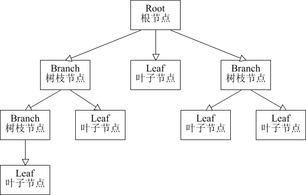

## composite 组合模式

概念:它是一种将对象组合成树状的层次结构的模式,用部分-整体表示关系,使用户对单个对象的访问和对组合对象的访问方式一致.

组合模式的主要优点有：
- 组合模式使得客户端代码可以一致地处理单个对象和组合对象，无须关心自己处理的是单个对象，还是组合对象，这简化了客户端代码；
- 更容易在组合体内加入新的对象，客户端不会因为加入了新的对象而更改源代码，满足“开闭原则”；

其主要缺点是：
- 设计较复杂，客户端需要花更多时间理清类之间的层次关系；
- 不容易限制容器中的构件；
- 不容易用继承的方法来增加构件的新功能；